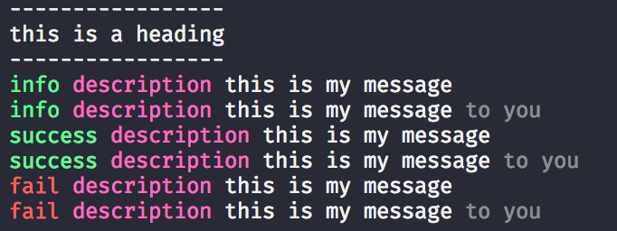

# CLI Reporter

[![NPM version][badge-npm]][info-npm]
[![Node version][badge-node]][info-node]
![MIT License][badge-license]

Standardised command-line reporter for frontend toolkit modules.

## Install

```
$ npm install @springernature/util-cli-reporter
```

## Usage

```javascript
const reporter = require('@springernature/util-cli-reporter');

reporter.title('this is a heading');

reporter.info('description', 'this is my message');
reporter.info('description', 'this is my message', 'to you');

reporter.success('description', 'this is my message');
reporter.success('description', 'this is my message', 'to you');

reporter.fail('description', 'this is my message');
reporter.fail('description', 'this is my message', 'to you');
```

### Output



## License

[MIT License][info-license] &copy; 2019, Springer Nature

[info-npm]: https://www.npmjs.com/package/@springernature/util-cli-reporter
[badge-npm]: https://img.shields.io/npm/v/@springernature/util-cli-reporter.svg
[info-license]: https://github.com/springernature/frontend-toolkit-utilities/blob/master/LICENCE
[badge-license]: https://img.shields.io/badge/license-MIT-blue.svg
[badge-node]: https://img.shields.io/badge/node->=8-brightgreen.svg
[info-node]: package.json
