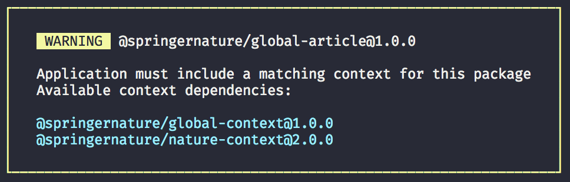

# Context Warning

[![NPM version][badge-npm]][info-npm]
[![Node version][badge-node]][info-node]
![MIT License][badge-license]

When installing a package from the Elements Design System, output some messaging to the command-line to warn about installing a context dependency in your application.

This package only handles formatting of the output message, working out valid dependencies needs to be done elsewhere.

## Command line usage

Use via NPX

```
$ npx @springernature/util-context-warning [options]
```

### Command line options

```
-p, --package  Name of package
-c, --context  Space separated <name>@<version> for all context options
```

### Full example

```
$ npx @springernature/util-context-warning \
      -p @springernature/global-article@1.0.0 \
	  -c @springernature/global-context@1.0.0 @springernature/nature-context@2.0.0
```



## License

[MIT License][info-license] &copy; 2020, Springer Nature

[info-npm]: https://www.npmjs.com/package/@springernature/util-context-warning
[badge-npm]: https://img.shields.io/npm/v/@springernature/util-context-warning.svg
[info-license]: https://github.com/springernature/frontend-toolkit-utilities/blob/master/LICENCE
[badge-license]: https://img.shields.io/badge/license-MIT-blue.svg
[badge-node]: https://img.shields.io/badge/node->=8-brightgreen.svg
[info-node]: package.json
