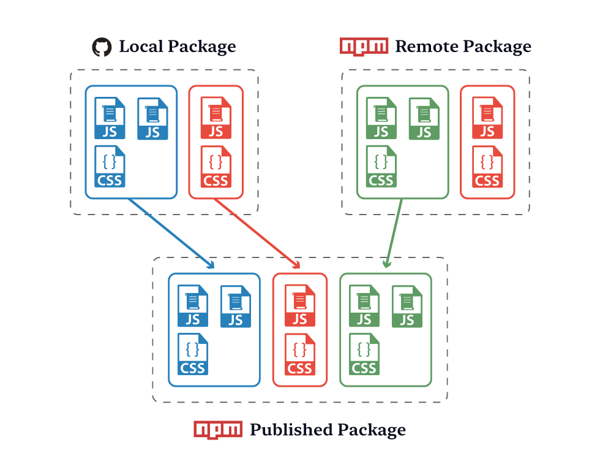

# Package Extender

[![NPM version][badge-npm]][info-npm]
[![Node version][badge-node]][info-node]
![LGPL 3.0 licensed][badge-license]

This helper allows you to extend one Component Package (remote) with another (local). The helper merges files from the remote package with files from the local, ignoring any files in the remote that already exist at the local level.

**Remote Package** - package being extended, published to NPM  
**Local Package** - package that extends the remote



This should be run from within the repository of the local package, and requires the local package to have a `package.json` file with the fields `name`, `version`, `extendsPackage`. The last of these should define the name and version of the remote package in the format `package-name@version`. For example:

```json
{
  "name": "brand-package",
  "version": "1.0.0",
  "extendsPackage": "global-package@2.0.0"
}
```

## Install

```
$ npm install @springernature/util-package-extender
```

## Usage

The helper exports two functions:

### `getPackageExtensionDetails(packageJsonObject, packageScope)`

Returns `Undefined` if the `package.json` file is missing one of `name`, `version`, `extendsPackage`. Otherwise returns an `Object` containing extension details.

#### `packageJsonObject`
Type: `Object`

A Javascript Object representing the `package.json` file of the local package.

#### `packageScope`
Type: `String`  
Default: 'springernature'

The scope under which to search for the remote package (only works with scoped packages at the moment).

#### Example

```javascript
const extender = require('@springernature/util-package-extender');
const obj = require('./package.json');

// With default scope
// ------------------
const packageExtensionDetails = extender.getPackageExtensionDetails(obj);
// Returns =>
// {
//   remotePackage: '@springernature/global-package@2.0.0',
//   localPackage: 'brand-package@1.0.0'
// }

// With custom scope
// -----------------
const packageExtensionDetails = extender.getPackageExtensionDetails(obj, 'my-scope');
// Returns =>
// {
//   remotePackage: '@my-scope/global-package@2.0.0',
//   localPackage: 'brand-package@1.0.0'
// }
```

### `extendPackage(packageJsonPath, remotePackage, localPackage, outputDirectory)`

Returns a `Promise` after merging the two packages on the local filesystem. Files from the remote package are either merged in place with the local files, or merged into an output directory with a copy of the local files.

#### `packageJsonPath`
Type: `String`

Location of the `package.json` file for the local package.

#### `remotePackage`
Type: `String`

Name and version of the remote package in the format `package-name@version`.

#### `localPackage`
Type: `String`

Name and version of the local package in the format `package-name@version`.

#### `outputDirectory`
Type: `String`  
Default: null

Directory in which to store the merged files. Defaults to merging in place with the local files.

#### Example

```javascript
const extender = require('@springernature/util-package-extender');
const obj = require('./package.json');
const packageExtensionDetails = extender.getPackageExtensionDetails(obj);

// Merge in place
// --------------
if (packageExtensionDetails) {
    extender.extendPackage(
        '.',
        packageExtensionDetails.remotePackage,
        packageExtensionDetails.localPackage
    )
    .then(() => {console.log('success')})
    .catch(err => {console.error(err)});
}

// Merge into output directory (./demo)
// ------------------------------------
if (packageExtensionDetails) {
    extender.extendPackage(
        '.',
        packageExtensionDetails.remotePackage,
        packageExtensionDetails.localPackage,
        './demo'
    )
    .then(() => {console.log('success')})
    .catch(err => {console.error(err)});
}
```

## License

[MIT License][info-license] &copy; 2019, Springer Nature

[info-npm]: https://www.npmjs.com/package/@springernature/util-package-extender
[badge-npm]: https://img.shields.io/npm/v/@springernature/util-package-extender.svg
[info-license]: https://github.com/springernature/frontend-toolkit-utilities/blob/master/LICENCE
[badge-license]: https://img.shields.io/badge/license-MIT-blue.svg
[badge-node]: https://img.shields.io/badge/node->=8-brightgreen.svg
[info-node]: package.json